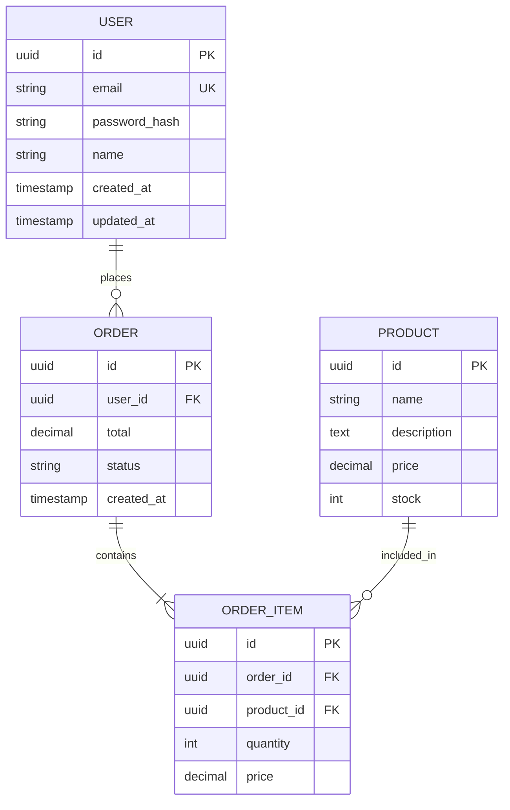

# Data Model

**Project:** {{PROJECT_NAME}}
**Last Updated:** {{DATE}}

## Table of Contents

- [Entity Relationship Diagram](#entity-relationship-diagram)
- [Entity Definitions](#entity-definitions)
- [Relationships](#relationships)
- [Query Patterns](#query-patterns)
- [Migrations](#migrations)

---

## Entity Relationship Diagram

```mermaid
erDiagram
    {{ER_DIAGRAM}}
```

**Example:**



---

## Entity Definitions

### User Entity

**Purpose:** Represents system users

**TypeScript Interface:**

```typescript
// File: src/models/User.ts

export interface User {
  id: string;                  // UUID primary key
  email: string;               // Unique email address
  passwordHash: string;        // Bcrypt hashed password
  name: string;                // Display name
  role: UserRole;              // User role (see enum)
  emailVerified: boolean;      // Email verification status
  createdAt: Date;             // Account creation timestamp
  updatedAt: Date;             // Last update timestamp
}

export enum UserRole {
  USER = 'user',
  ADMIN = 'admin',
  SUPERADMIN = 'superadmin',
}

export type CreateUserData = Omit<User, 'id' | 'createdAt' | 'updatedAt' | 'emailVerified'>;
export type UpdateUserData = Partial<Omit<User, 'id' | 'createdAt' | 'email'>>;
```

**Database Schema (Prisma):**

```prisma
// File: prisma/schema.prisma

model User {
  id            String   @id @default(uuid())
  email         String   @unique
  passwordHash  String   @map("password_hash")
  name          String
  role          UserRole @default(USER)
  emailVerified Boolean  @default(false) @map("email_verified")
  createdAt     DateTime @default(now()) @map("created_at")
  updatedAt     DateTime @updatedAt @map("updated_at")

  // Relations
  orders        Order[]
  sessions      Session[]

  @@map("users")
}

enum UserRole {
  USER
  ADMIN
  SUPERADMIN
}
```

**Indexes:**

```sql
-- Email index (unique constraint handles this)
CREATE UNIQUE INDEX users_email_idx ON users(email);

-- Created at index for sorting
CREATE INDEX users_created_at_idx ON users(created_at DESC);

-- Role index for admin queries
CREATE INDEX users_role_idx ON users(role) WHERE role != 'USER';
```

---

## Relationships

### One-to-Many: User → Orders

**Relationship:** A user can have many orders

**TypeScript:**

```typescript
// File: src/models/User.ts
export interface UserWithOrders extends User {
  orders: Order[];
}

// File: src/repositories/user.repository.ts
async findWithOrders(userId: string): Promise<UserWithOrders | null> {
  return await this.prisma.user.findUnique({
    where: { id: userId },
    include: { orders: true },
  });
}
```

### Many-to-Many: Order ↔ Products (through OrderItems)

**Relationship:** Orders contain multiple products via order items

**TypeScript:**

```typescript
// File: src/models/Order.ts
export interface OrderWithItems extends Order {
  items: OrderItemWithProduct[];
}

export interface OrderItemWithProduct extends OrderItem {
  product: Product;
}

// File: src/repositories/order.repository.ts
async findWithItems(orderId: string): Promise<OrderWithItems | null> {
  return await this.prisma.order.findUnique({
    where: { id: orderId },
    include: {
      items: {
        include: { product: true },
      },
    },
  });
}
```

---

## Query Patterns

### Pattern: Pagination

**When to use:** Listing entities with large datasets

**Implementation:**

```typescript
// File: src/repositories/user.repository.ts

interface PaginationParams {
  page: number;
  limit: number;
  sortBy?: string;
  sortOrder?: 'asc' | 'desc';
}

interface PaginatedResult<T> {
  items: T[];
  total: number;
  page: number;
  limit: number;
  totalPages: number;
}

async findPaginated(params: PaginationParams): Promise<PaginatedResult<User>> {
  const { page, limit, sortBy = 'createdAt', sortOrder = 'desc' } = params;
  const skip = (page - 1) * limit;

  const [items, total] = await Promise.all([
    this.prisma.user.findMany({
      skip,
      take: limit,
      orderBy: { [sortBy]: sortOrder },
      select: {
        id: true,
        email: true,
        name: true,
        role: true,
        createdAt: true,
        // Exclude passwordHash from list queries
      },
    }),
    this.prisma.user.count(),
  ]);

  return {
    items,
    total,
    page,
    limit,
    totalPages: Math.ceil(total / limit),
  };
}
```

### Pattern: Filtered Queries

**When to use:** Searching or filtering entities

**Implementation:**

```typescript
// File: src/repositories/user.repository.ts

interface UserFilters {
  role?: UserRole;
  emailVerified?: boolean;
  search?: string;  // Search in name or email
  createdAfter?: Date;
}

async findFiltered(filters: UserFilters): Promise<User[]> {
  const where: any = {};

  if (filters.role) {
    where.role = filters.role;
  }

  if (filters.emailVerified !== undefined) {
    where.emailVerified = filters.emailVerified;
  }

  if (filters.search) {
    where.OR = [
      { email: { contains: filters.search, mode: 'insensitive' } },
      { name: { contains: filters.search, mode: 'insensitive' } },
    ];
  }

  if (filters.createdAfter) {
    where.createdAt = { gte: filters.createdAfter };
  }

  return await this.prisma.user.findMany({
    where,
    orderBy: { createdAt: 'desc' },
  });
}
```

### Pattern: Efficient Joins

**When to use:** Loading related data efficiently

**Implementation:**

```typescript
// File: src/repositories/order.repository.ts

/**
 * Get order with all related data in one query
 * Avoids N+1 query problem
 */
async findComplete(orderId: string): Promise<CompleteOrder | null> {
  return await this.prisma.order.findUnique({
    where: { id: orderId },
    include: {
      user: {
        select: {
          id: true,
          email: true,
          name: true,
          // Don't include passwordHash
        },
      },
      items: {
        include: {
          product: true,
        },
      },
    },
  });
}

// ❌ BAD: N+1 query problem
async function getOrderBad(orderId: string) {
  const order = await prisma.order.findUnique({ where: { id: orderId } });
  const user = await prisma.user.findUnique({ where: { id: order.userId } }); // Extra query
  const items = await prisma.orderItem.findMany({ where: { orderId } }); // Extra query
  // For each item, query product (N queries!)
  for (const item of items) {
    item.product = await prisma.product.findUnique({ where: { id: item.productId } });
  }
  return { order, user, items };
}
```

---

## Migrations

### Migration Strategy

**Tool:** Prisma Migrate

**Workflow:**

```bash
# 1. Create migration after schema change
npx prisma migrate dev --name add_user_role_field

# 2. Review generated SQL
cat prisma/migrations/*/migration.sql

# 3. Apply to production
npx prisma migrate deploy
```

**Example Migration:**

```sql
-- Migration: add_email_verified_field
-- Created: 2025-12-04

ALTER TABLE "users"
ADD COLUMN "email_verified" BOOLEAN NOT NULL DEFAULT false;

-- Create index for faster queries on unverified users
CREATE INDEX "users_email_verified_idx"
ON "users"("email_verified")
WHERE "email_verified" = false;
```

### Data Migration Example

**Scenario:** Populate new field from existing data

```typescript
// File: prisma/migrations/20251204_populate_user_roles.ts

import { PrismaClient } from '@prisma/client';

const prisma = new PrismaClient();

async function main() {
  // Set role based on email domain
  await prisma.user.updateMany({
    where: {
      email: { endsWith: '@admin.com' },
      role: 'USER', // Only update if still default
    },
    data: {
      role: 'ADMIN',
    },
  });

  console.log('Migration completed: User roles populated');
}

main()
  .catch((e) => {
    console.error(e);
    process.exit(1);
  })
  .finally(async () => {
    await prisma.$disconnect();
  });
```

---

## Best Practices

### DO:

✅ Use UUIDs for primary keys (prevents enumeration attacks)
✅ Add timestamps (createdAt, updatedAt) to all entities
✅ Use indexes on frequently queried fields
✅ Normalize data to avoid duplication
✅ Use transactions for multi-table updates
✅ Soft delete important data (add `deletedAt` field)

### DON'T:

❌ Store passwords in plain text (always hash with bcrypt)
❌ Include sensitive data in API responses (use DTOs)
❌ Make N+1 queries (use includes/joins)
❌ Ignore database constraints (use foreign keys, unique constraints)
❌ Skip migrations (always version schema changes)

---

**Related Documentation:**
- [patterns.md](./patterns.md) - Repository pattern implementation
- [tech-stack.md](./tech-stack.md) - Database technology details
- [folder-structure.md](./folder-structure.md) - Where to place models/repositories

**Last Updated:** {{DATE}}
**Version:** {{VERSION}}
